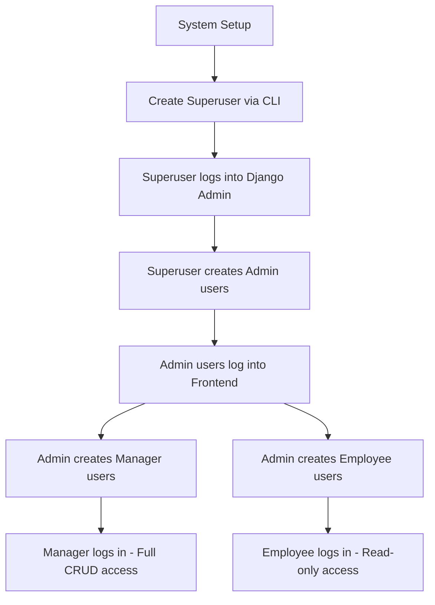

# 🧠 BrainWise Employee Management System

A comprehensiv## 📋 Table of Contents

- [🎯 Project Overview](#-project-overview)
- [🚀 Key Features](#-key-features)
- [🛠️ Technology Stack](#️-technology-stack)
- [⚡ Quick Start](#-quick-start)
- [🏗️ Project Structure](#️-project-structure)
- [🔐 User Roles & Permissions](#-user-roles--permissions)
  - [🎯 Application Flow & User Management](#-application-flow--user-management)
  - [🛡️ Security Implementation](#️-security-implementation)
- [🌐 API Documentation](#-api-documentation)
- [🎨 UI/UX Features](#-uiux-features)ck employee management system built with Django REST Framework and React, featuring role-based access control, JWT authentication, and modern UI/UX design.

## 🎯 Project Overview

**BrainWise** is a modern, scalable employee management solution designed to streamline HR operations and workforce management. This full-stack application combines a powerful Django REST API backend with a responsive React frontend to deliver a complete enterprise-grade solution.

### 🏗️ Architecture

The system follows a **microservices-inspired architecture** with clear separation of concerns:

- **🔧 Backend**: Django REST Framework API providing secure, scalable business logic
- **💻 Frontend**: React SPA (Single Page Application) with modern UI/UX design
- **🔐 Authentication**: JWT-based stateless authentication with automatic token refresh
- **� Database**: SQLite (development) with easy migration to PostgreSQL/MySQL

### 🎯 Target Users

- **🏢 Small to Medium Enterprises** looking for efficient employee management
- **👥 HR Departments** needing comprehensive workforce tracking
- **📈 Organizations** requiring role-based access control and data analytics
- **🚀 Startups** seeking scalable, cost-effective HR solutions

### 💼 Business Value

- **Centralized Employee Data**: Single source of truth for all employee information
- **Role-Based Security**: Granular access control ensuring data privacy
- **Real-Time Analytics**: Instant insights into workforce metrics
- **Scalable Architecture**: Grows with your organization's needs
- **Modern Interface**: Intuitive, responsive design for all devices

## � Documentation Structure

### 🎨 Frontend Documentation
**[📖 Frontend README](./frontend/README.md)** - Complete guide for the React frontend
- React 19.1.1 with Vite setup
- Component architecture and routing
- Authentication flow and state management
- UI/UX design patterns and styling
- Role-based access control implementation
- API integration and error handling

### ⚙️ Backend Documentation
**[📖 Backend README](./backend/README.md)** - Comprehensive Django API guide
- Django REST Framework implementation
- Database models and relationships
- Authentication and permissions system
- API endpoints and serializers
- Admin interface customization
- Testing and deployment strategies

### 📋 Additional Resources
- **[📋 API Documentation](./backend/API_DOCUMENTATION.md)** - Detailed API endpoints reference
- **[📦 Requirements](./requirements.txt)** - Python dependencies and versions
- **[⚡ Quick Start Guide](#-installation--setup)** - Get up and running in minutes

## � Table of Contents

- [🎯 Project Overview](#-project-overview)
- [�🚀 Key Features](#-key-features)
- [🛠️ Technology Stack](#️-technology-stack)
- [⚡ Quick Start](#-quick-start)
- [🏗️ Project Structure](#️-project-structure)
- [🔐 User Roles & Permissions](#-user-roles--permissions)
- [🌐 API Documentation](#-api-documentation)
- [🎨 UI/UX Features](#-uiux-features)

## 🚀 Key Features

### 🔐 Authentication & Authorization
- **JWT-based Authentication** with automatic token refresh
- **Role-Based Access Control** (Admin, Manager, Employee)
- **Secure Token Management** with 15-minute access tokens
- **Django Admin Integration** for privileged users

### 👥 Employee Management
- **Complete CRUD Operations** for employee records
- **Employee Profiles** with detailed information
- **Hire Date Tracking** and employment status
- **Department and Company Associations**
- **Advanced Search and Filtering**
- **📊 Employee Report** - Comprehensive report showing hired employees with:
  - Employee details (name, email, mobile, position)
  - Employment information (hired date, days employed)
  - Company and department associations
  - Sortable columns and search functionality
  - Summary statistics and analytics

### 🏢 Company & Department Management
- **Company Profiles** with descriptions and metadata
- **Department Organization** within companies
- **Employee Distribution Analytics**
- **Hierarchical Data Structure**

### 📊 Dashboard & Analytics
- **Real-time Statistics** (employee count, companies, departments)
- **User Information Display**
- **Quick Navigation** to key features
- **Role-based UI Rendering**

### 🛡️ Security Features
- **CORS Configuration** for secure cross-origin requests
- **Token Blacklisting** on logout
- **Input Validation** and sanitization
- **Role-based UI Restrictions**

## 🛠️ Technology Stack

### 🔧 Backend Stack
- **[Django 4.2.7](./backend/employee_management/settings.py)** - Web framework
- **Django REST Framework 3.14.0** - API development
- **djangorestframework-simplejwt 5.3.0** - JWT authentication
- **django-cors-headers 4.3.1** - CORS handling
- **[SQLite](./backend/db.sqlite3)** - Database (easily configurable to PostgreSQL/MySQL)

### 💻 Frontend Stack
- **[React 19.1.1](./frontend/README.md)** - UI library
- **[Vite 7.1.2](./frontend/vite.config.js)** - Build tool and dev server
- **[React Router DOM 7.8.2](./frontend/src/App.jsx)** - Client-side routing
- **[Axios 1.11.0](./frontend/src/services/apiService.js)** - HTTP client with interceptors
- **[Custom CSS](./frontend/src/App.css)** - Responsive design without external UI libraries

> 📖 **For detailed component documentation:**
> - **[Frontend Setup & Architecture](./frontend/README.md)** - React application guide
> - **[Backend API & Database](./backend/README.md)** - Django REST framework guide

## ⚡ Quick Start

**🚀 Get BrainWise running in 5 minutes!**

### 🔧 Backend Setup
> For detailed backend setup, see **[Backend README](./backend/README.md)**

1. **Clone the repository:**
   ```bash
   git clone <repository-url>
   cd brainwise
   ```

2. **Create and activate virtual environment:**
   ```bash
   python -m venv venv
   source venv/bin/activate  # On Windows: venv\Scripts\activate
   ```

3. **Install backend dependencies:**
   ```bash
   pip install -r requirements.txt
   ```

4. **Navigate to backend directory:**
   ```bash
   cd backend
   ```

5. **Run database migrations:**
   ```bash
   python manage.py makemigrations
   python manage.py migrate
   ```

6. **Create superuser (optional):**
   ```bash
   python manage.py createsuperuser
   ```

7. **Start Django development server:**
   ```bash
   python manage.py runserver
   ```

🎉 **Backend API available at:** `http://localhost:8000`

### 💻 Frontend Setup
> For detailed frontend setup and development guide, see **[Frontend README](./frontend/README.md)**

1. **Navigate to frontend directory:**
   ```bash
   cd frontend
   ```

2. **Install frontend dependencies:**
   ```bash
   npm install
   ```

3. **Start development server:**
   ```bash
   npm run dev
   ```

🎉 **Frontend application available at:** `http://localhost:5173`

### 🌐 Access the Application
- **Frontend UI**: http://localhost:5173
- **Backend API**: http://localhost:8000/api
- **Django Admin**: http://localhost:8000/admin

> 🔧 **Need more detailed setup instructions?**
> - **[Frontend Development Guide](./frontend/README.md)** - React setup, components, styling
> - **[Backend Development Guide](./backend/README.md)** - Django configuration, models, API

## 🔐 User Roles & Permissions

### 🎯 Application Flow & User Management

**BrainWise** follows a hierarchical user management system with strict role-based access control:

#### 🚀 Initial Setup Process

1. **🏗️ System Administrator Setup**
   ```bash
   # First, create a Django superuser - this is mandatory
   python manage.py createsuperuser
   ```
   - The **superuser** is the only user who can create initial accounts
   - This superuser has full Django admin access
   - This step is **required** before any other users can be created

2. **👥 User Account Creation Hierarchy**
   ```
   Superuser (Django Admin) 
   ↓ Creates
   Admin Users 
   ↓ Can Create
   Manager & Employee Users
   ```

#### 👑 Superuser (System Administrator)
- **Creation**: Created via Django command line (`python manage.py createsuperuser`)
- **Permissions**: 
  - Full system access including Django admin panel
  - Can create, modify, and delete any user account
  - Can perform all CRUD operations on all entities
  - System configuration and maintenance access
- **Responsibilities**: Initial system setup and user account management

#### 🔧 Admin Role
- **Creation**: Created by Superuser through Django admin interface
- **Account Creation Rights**: ✅ **Can create new user accounts** (Managers and Employees)
- **CRUD Operations**: Full access (Create, Read, Update, Delete) on:
  - Companies
  - Departments  
  - Employees
  - User accounts (limited to Manager and Employee roles)
- **Django Admin Access**: ✅  access to Django admin panel
- **UI Features**: All action buttons visible and functional

#### 👔 Manager Role  
- **Creation**: Created by Superuser or Admin
- **Account Creation Rights**: ❌ **Cannot create user accounts**
- **CRUD Operations**: Full access (Create, Read, Update, Delete) on:
  - Companies
  - Departments
  - Employees
- **Django Admin Access**: ❌ No access to Django admin panel
- **UI Features**: All action buttons visible and functional
- **Limitation**: Cannot manage user accounts or access system administration

#### 👤 Employee Role
- **Creation**: Created by Superuser or Admin  
- **Account Creation Rights**: ❌ **Cannot create user accounts**
- **CRUD Operations**: **Read-only access** to:
  - Companies (View only)
  - Departments (View only)
  - Employees (View only)
- **Django Admin Access**: ❌ No access to Django admin panel
- **UI Features**: Action buttons (Add, Edit, Delete) are hidden
- **Navigation**: Can browse and search data but cannot modify anything

#### 📊 Employee Report Access
- **Superuser**: ✅ Full access
- **Admin**: ✅ Full access  
- **Manager**: ✅ Full access
- **Employee**: ✅ Read-only access (can view report but cannot export or modify)

### 🔄 User Management Workflow



### 🛡️ Security Implementation

- **Authentication**: JWT tokens with 15-minute expiration
- **Authorization**: Role-based permissions enforced on both frontend and backend
- **UI Security**: Action buttons conditionally rendered based on user role
- **API Security**: All endpoints protected with appropriate permission classes
- **Token Management**: Automatic refresh with secure logout

## 🌐 API Documentation

### Authentication Endpoints
- `POST /api/accounts/login/` - User login
- `POST /api/accounts/logout/` - User logout
- `POST /api/accounts/signup/` - User registration
- `POST /api/accounts/token/refresh/` - Refresh JWT token

### Core Endpoints
- `GET/POST /api/core/companies/` - List/Create companies
- `GET/PUT/DELETE /api/core/companies/{id}/` - Company details
- `GET/POST /api/core/departments/` - List/Create departments
- `GET/PUT/DELETE /api/core/departments/{id}/` - Department details
- `GET/POST /api/core/employees/` - List/Create employees
- `GET/PUT/DELETE /api/core/employees/{id}/` - Employee details

### Report Endpoints
- `GET /api/core/employees/report/` - **Employee Report** (hired employees only)

### Utility Endpoints
- `GET /api/core/companies/{id}/departments/` - Company departments
- `GET /api/core/employees/?department={id}` - Department employees
- `GET /api/core/employees/?company={id}` - Company employees

## 🎨 UI/UX Features

- **Responsive Design** - Works on desktop, tablet, and mobile
- **Professional Styling** - Clean, modern interface
- **Role-based UI** - Different interfaces for different user roles
- **Loading States** - Smooth loading indicators
- **Error Handling** - User-friendly error messages
- **Form Validation** - Client and server-side validation
